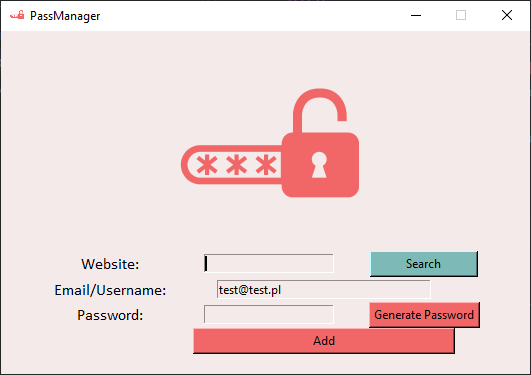
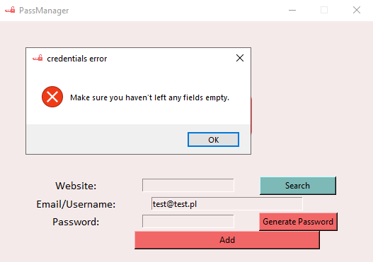
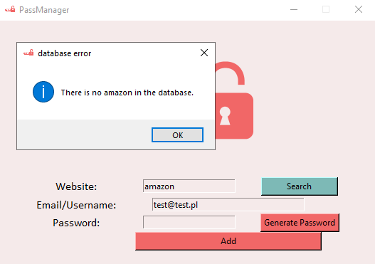
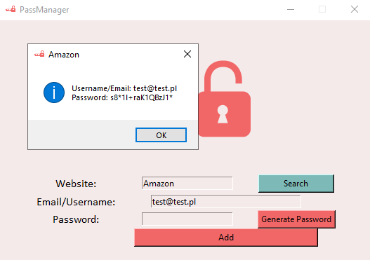
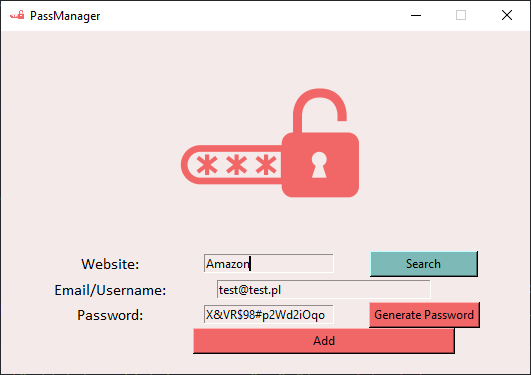
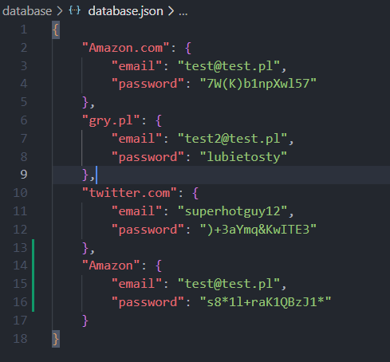

# password-manager
 <h2>PassManager is a simple password manager that stores and keeps track of your login credentials.</h2>
 
It stores all the data inside a json file. It's an easy to send/sycn format. 
That's not the safest option and I will be working on upgrading it for a safer method. 
<h3>PassManager is a simple GUI app.</h3>
 
<h3>It does check if all the boxes were filled.</h3>
 
<h3>It has a function that goes through the data file and checks if the given website is already there.</h3>
 
<h3>If there is you will get both login(or email) and password for this website.</h3>
 
<h3>You can either insert your own password or click "Generate Password" button to get a complicated and strong one.</h3>

Generated password will automatically be copied to your clipboard and ready to paste in by you on any site or app.
 
<h3>Login credentials are stored this way:</h3>

But as I said it's an temporary solution.  

Modules used:
<ul>
 <li>tkinter</li>
 <li>random</li>
 <li>pyperclip</li>
 <li>json</li>
</ul>
